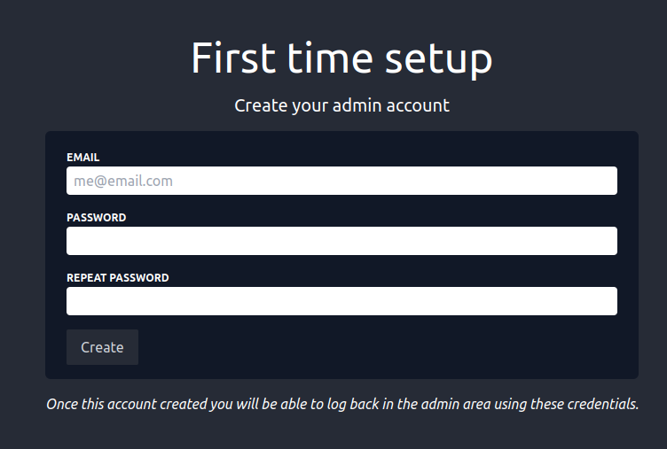
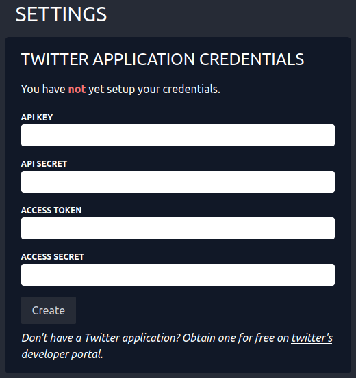
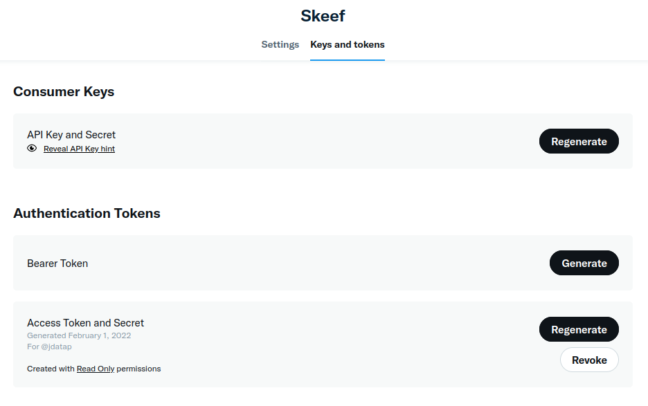
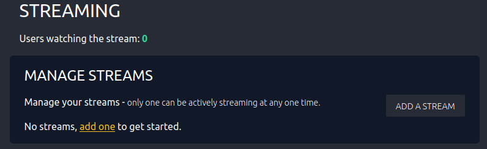

# Setup App

To setup skeef simply run the application and visit the app
at the address you specified (see setup in the previous page),
e.g.: `localhost:8080`.

## Admin account

When visiting this page for the first time you should be redirected
to a page to create the admin account.

:::caution

There can only be one admin account, you must reset (see run)
in order to create a new one: do not forget your password.

:::

Fill in your email and password of choice.

## Twitter credentials

After having created your admin account your will be redirected
to the admin area.

The admin area is where you can create stream, edit, start, and stop
them.
Before doing so you need to add your Twitter credentials, these 
are stored locally and used to stream tweets.

This step is mandatory, without it one cannot setup streams.

:::danger

Currently, twitter credentials are stored in the sqlite database
on disk. This may be too insecure for you, check with your IT
security department if you are unsure.

:::

To obtain these credentials create a _free_ twitter application at 
[developer.twitter.com/en/portal/apps](https://developer.twitter.com/en/portal/apps)

Click "generate" or "regenerate" and use the credentials where appropriate
e.g.: paste the API key in the relevant inputs in the application.

One done click "create."

## Your first stream

Once the above done you can setup your first stream!

After adding your Twitter credentials a new area should have been added
at the top of the page.

You can now add streams to skeef, you can add as many as you want
but _only one can be active at any one time._

Click "add one" or "add a stream" to add your first stream!
