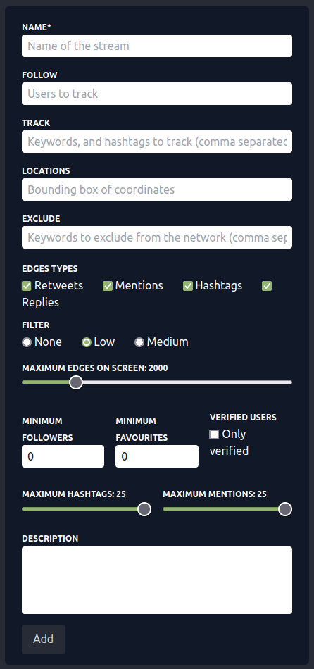

# Stream

Guide to adding or updating a stream; both interface
are identical.

:::info

Streams can be edited when paused.

:::

- __Name__: The name of the stream. 
This will be displayed on the admin page as well as the stream
page for your users to know more about what is being visualised.
- __Follow__: Twitter handles to track.
You can either track specific keywords and hashtags, or users,
in which case every tweet from that user will be displayed on the 
graph. This is passed directly to the Twitter API.
- __Track__: Keywords or hashtags to track. 
This is passed directly to the Twitter API which will return
tweets containing said keywords. Note that the API does not 
return every tweet.
- __Locations__: You can restrict the tweets captured by the 
API to a certain location by providing it a bounding box of
coordinates, see the 
[official documentation](https://developer.twitter.com/en/docs/twitter-api/v1/tweets/filter-realtime/guides/basic-stream-parameters#locations)
for more information.
- __Exclude__: Keywords to exclude from the visualisation.
Perhaps you are interested in, say, Elon Musk and thus want to use this
as a keyword, however, you want to exclude any of his "memes".
- __Edge Types__: Ultimately skeef builds a graph from the tweets
collected via the API, these can be built in numerous ways.
It's ultimately important to grasp this in order to make some
sense of what is visualised.

  - __Retweets__: The tweet `@me tweets your keyword` is retweeted by 
    `@you` will draw an edge between `@me` and `@you`.
  - __Mentions__: The tweet `@me your keyword and tags @you` will draw
    an edge between `@me` and `@you`.
  - __Hashtags__: The tweet `@me tweets your #yourKeyword` draws an
    an edge between `@me` and `#yourKeyword`, note that hashtag nodes
    are colored differently in the graph.
  - __Replies__: I tweet `Something about your keyword` and `@you` reply
    to the tweet draws an edge between me and `@you`.

- __Maximum edges on screen__: The maximum number of edges that can
be visible on the graph before oldest edges start being removed. 
This is important for performances, this graph is help in memory
and sent via WebSocket to users who join the stream so all concurrent 
users should see the same graph.
- __Minimum followers__: Minimum number of followers the author of 
the tweet must have made.
- __Minimum favourites__: Minimum number of favourites a tweet should
have to be considered for the graph.
- __Maximum hashtags__: A very useful filter to remove noise and bots
from your graphs. This will filter out any tweets that include more than
the set number of hashtags.
- __Maximum mentions__: Maximum number of `@mention` in a tweets,
similar as the above filter, it is very useful to remove noise and bots.
- __Description__: Description of the stream, this is made visible
to users who visit the stream.
