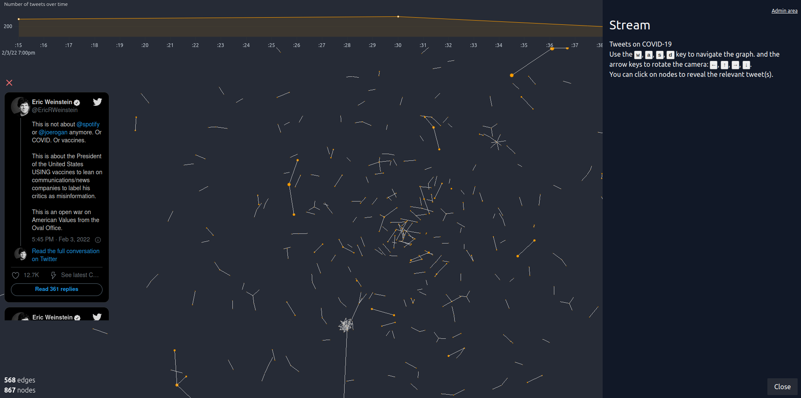

# The stream

The stream page looks like the screenshot below.

At the top is the trend plot showing the number of tweets at
every 15 seconds interval.

You can open the drawer on the right by clicking the question mark
(`?`) at the bottom right of the screen.
It includes the description of your stream as well as instructions 
on how to navigate the graph.

At the center is the graph created from the stream of tweets.

You can click a node to reveal the tweet(s) that have placed
the node on the graph. They appear on the left-hand side as
shown on the screenshot above.
