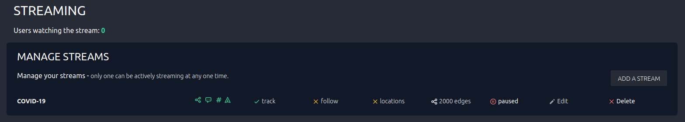

# Manage Streams

Once one or more stream has been added to the application
they will be listed on the admin page.

- The green icons on the left indicate the type of edges that being build.
- The following two columns show whether it is tracking keywords or users.
- The fourth column indicates whether the stream is limited to a certain
location.
- Then comes the maximum number of edges that can be shown for that stream.
- The following column shows whether the stream is active or paused,
clicking this allows toggling the stream on and off.
- The last two columns are to edit and delete streams.
